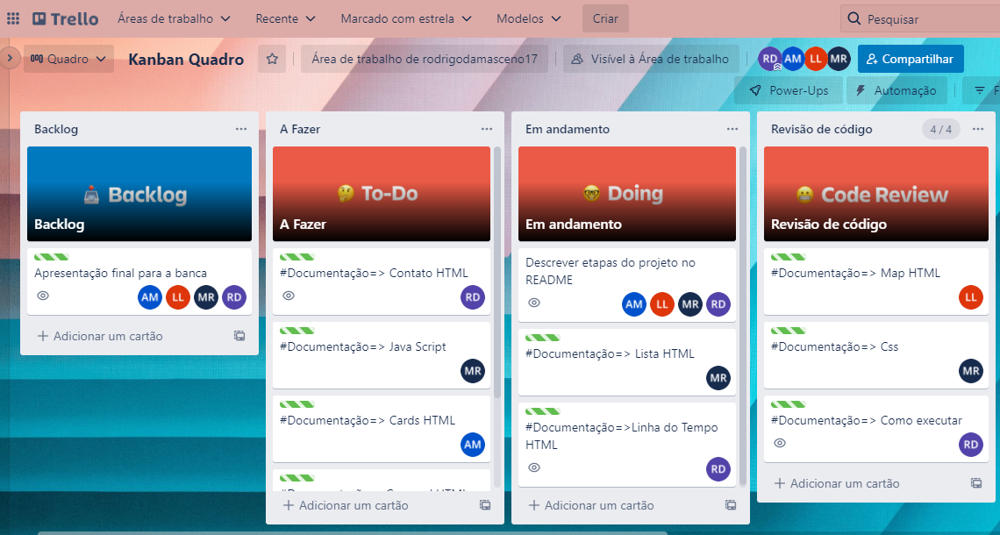
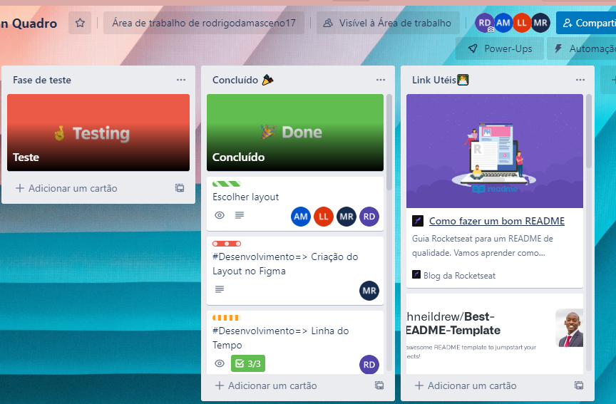
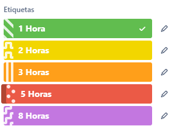

<h1 align=center>Crypto-sLedger - <a target="_blank" href="https://starlit-nougat-eb55ac.netlify.app/" rel="nofollow">Demo</a> </h1>


<p align=center>
  
  
  
 
 
 
 
 

</p>

<h1 align="center"> Sumário </h1>
<div id="sumario">
	<ul>
		<li><a href="#kanban"> Kanban</li>
    <li><a href="#figma"> Figma</li>
		<li><a href="#css"> Css  </a></li>
		<li><a href="#html"> Html - Página Principal </a> </li>
    <li><a href="#htmlc"> Html - Contato</a> </li>
    <li><a href="#htmllt"> Html - Linha do Tempo</a> </li>
		<li><a href="#js"> Java Script </a></li>
    <li><a href="#deploy"> Como executar </a></li>
	</ul>	
</div>

<br></br>
<h1 id="kanban">Kanban</h1>

Para o controle do fluxo de desenvolvimento deste código foi utilizado o modelo Kanban feito na ferramenta Trello. Sua estrutura foi feita da seguinte forma:

 
<h6 align="center"> Imagem do quadro Kanban 1 </h6>

<h6 align="center"> Imagem do quadro Kanban 2 </h6>

Além de adotar o método Kanban, cada atividade a ser executada foi relacionada com uma etiqueta que equivale a quantas horas, em média, levariam para ela ser feita, facilantando assim a organização e separação de atividades para cada membro. Abaixo podemos ver as etiquetas usadas e neste [link](https://trello.com/invite/b/iU37sCzw/ae9a9a300e5e1837bc020126144c978b/kanban-quadro) pode-se acessar o quadro no Trello.


<h6> Imagem das etiquetas Kanban  </h6>

<br></br>
<h1 id="figma">Figma</h1>

Para a inicialização da construção da **Landing Page**, criou-se um layout utilizando a ferramenta [Figma](https://www.figma.com/), com o desenho inicial que a página teria.

O layout construído para este projeto pode ser acessado pelo seguinte link: [Figma CriptoGama](https://www.figma.com/file/4ehk8bnEpPiWYGK06Mh0Fi/CriptoGma).


<br></br>
<h1 id="css">CSS</h1> 

### Introdução
Para uma melhor organização e padrinização do nosso trabalho, usaremos referenciadores do Css, que podem se acessados diretamente pelo `root`.
- Na pasta css você encontrará:
```css
css
|_ global.css
|_ main.css
|_ responsive.css
|_ style.css
```
### 1. O arquivo `global.css` 
Este arquivo contém ou deverá conter todos os estilos usados no layout do arquivo Figma. Portanto, vocé irá se deparas com algumas variáveis css que são:

```css
  /* Primary Colors */
  --primary: #00de8d;
  --secondary: rgba(8, 67, 47, 0.45);
  --back-ground: #020e0a;
  --card-background: rgba(255, 255, 255, 0.02);

  /* Button Style*/
  --btn-bg: rgba(255, 255, 255, 0.02);
  --border-btn: 1px solid rgba(0, 222, 141, 0.75);

  /* Font Colors */
  --simple-title: #ecf1f0;
  --sub-title: #b6b6b6;
```
### 2. O arquivo `main.css`
Este arquivo é a importação de todos os arquivos css, inclusive do Bootstrap V.5.0.2, isso nos proporciona uma melhor organização do nosso `head`, uma vez que 
iremos importar apenas um arquivo `css` e não quatro.

```css

/* ===Bootstrap=== */
@import url(https://cdn.jsdelivr.net/npm/bootstrap@5.0.2/dist/css/bootstrap.min.css);
/* ===Bootstrap=== */
@import url(/css/global.css);
@import url(/css/style.css);
@import url(/css/responsive.css);
```
Como ficará em nosso `head`
```html
<!DOCTYPE html>
<html lang="en">
<head>
...
<link rel="stylesheet" href="css/main.css" />
...
</head>
```
### 3. O arquivo `responsive.css`
Este arquivo será destinado a resolver quais quer problemas de responsividade que o `bootstrap` não conseguir resolver.

### 4. O arquivo `style.css`
Este arquivo irá conter todos os estilos alternativos ao padrão do `bootstrap`, assim adequando o template ao layout base.

```css

@import url("https://fonts.googleapis.com/css2?family=Raleway:wght@200;300;400;500;600;700;800&display=swap");

* {
  padding: 0;
  margin: 0;
  box-sizing: border-box;
}
body,
html {
  background-color: var(--back-ground);
  font-family: "Raleway", sans-serif;
}
/* === HEADER === */

...
```

<br></br>
<h1 id="html">HTML - Página Principal</h1>

### Header
Descrição

### Carousel
Para construção do corousel foi ultilizdo o framework Bootstrap, o componente corousel com indicadores, juntamente com os controles. Foi escolhido tres imagens para compor o carousel. No CSS foi usado duas classes : .cripto-carousel - seguindo o layout da pagina 
                                                        .carousel - para o carousel ficar com as dimensões desejadas.

### Cards
Para os cards foi ultilizado o framework Bootstrap, o componente cards, com imagnes e texto. No CSS foi usado a classe : .cripto-cards - seguindo o padrão do layout.

### Lista com valores de criptos
Descrição

### Mapa
Para a criação do mapa, primeiro foi escolhido um local fictício, sendo este a sede da [Gama Academy](https://g.page/gamaacademybr?share), em seguida utilizou-se o BootStrap para implementar o mapa, com as classes referentes a renderização do mapa, e o iframe disponibilizado pelo Google Maps, além de uma trasição utilizando hover no CSS.

### Footer
Para a criação do rodapé, tendo como base o layout construído inicialmente no Figma, utilizou-se o BootStrap para implementação do mesmo, com as classes referentes a renderização do rodapé, contendo os seguintes componentes com hiperlinks:
- Ícones das principais redes sociais (Linkedin, Instagram e Twitter)
- Botões de navegação para as demais páginas (Home, Informações e Contato)
- Informações de contato (Endereço, Telefone e E-mail)


<br></br>
<h1 id="htmlc">HTML - Contato </h1>

Visando trazer algumas funcionalidades a mais, a Lading Page desenvolvida conta com outra página html que pode ser acessada pela navbar no botão de Contato. A partir disso o usuário é encaminhado para outra página com um formulário com campos para informações necessárias para a comunicação. O arquivo hmtl referente a essa págica é o [Contact](https://github.com/Rodrigodsgit/Crypto-sLedger/blob/main/contact.html)

<br></br>
<h1 id="htmllt">HTML - Linha do Tempo</h1>

Seguindo a mesma motivação da página "Contato", foi desenvolvido outro arquivo contendo uma breve linha do tempo a respeito da tecnlogica Blockchain, seu acesso é pelo o botão Iniciar na página inicial. O arquivo hmtl referente a essa págica é o [TimeLine](https://github.com/Rodrigodsgit/Crypto-sLedger/blob/main/timeLine.html).


<br></br>
<h1 id="js">JavaScript</h1>

### Exemplo
Exemplo

<br></br>
<h1 id="deploy">Como Executar</h1>

### Deploy 
Para facilitar a visualização da aplicação, ela já foi colocada no ar com auxílio do [Netlify](https://www.netlify.com/), assim como foi solicitado , e seu deploy pode ser acessado no seguinte link: [CriptoGama.](https://starlit-nougat-eb55ac.netlify.app/index.html)

Além disso, pode-se optar ainda por clonar este repositório e utilizar, por exemplo, a extensão Live Server do VSCode para rodar o site localmente.


